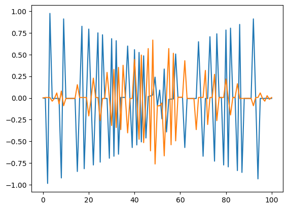

# SSH模型

## Reference

J. K. Asbóth, L. Oroszlány, and A. Pályi, *A Short Course on Topological Insulators: Band-Structure Topology and Edge States in One and Two Dimensions*, Lecture Notes in Physics **919** (Springer, 2016). [doi:10.1007/978-3-319-25607-8](https://doi.org/10.1007/978-3-319-25607-8); [arXiv:1509.02295](https://arxiv.org/abs/1509.02295).

## 概要

Su-Schrieffer-Heeger (SSH) 模型の略称。<br>
下図のような1次元の格子模型で、単位セルあたり 2 つのサイトAおよびBを持つ。<br>
サイト間の結合として最近接項のみを考慮している。（Tight-binding model）


SSH模型はシンプルな模型であるが、トポロジカル絶縁体の物理を理解するうえで重要である。
また、一部のメタマテリアルやフォトニック結晶の系においては、SSHモデルによってその物性を理解できる場合もある。（逆に、SSHで表せるようなシンプルな構造を実装する、という発想で構造を設計することもある。）

## ハミルトニアンと固有値

### On-site 基底による表現


格子のサイト数を$N$として、このモデルのハミルトニアンはOn-siteの基底を用いて以下のように表される。

$$
\begin{aligned}
H &= v \sum_{l=1}^{N} \left( \ket{l, B} \bra{l, A} + \ket{l, A} \bra{l, B} \right) 
+ w \sum_{l=1}^{N} \left(\ket{l+1, A} \bra{l, B} + \ket{l, B} \bra{l+1, A} \right) \\
&=: H_\mathrm{intra} + H_\mathrm{inter}
\end{aligned}
$$

- $v$: ユニットセル内の相互作用
- $w$: ユニットセル間の相互作用

例えば、$N=4$ のときは次のような行列で表される。

$$
\begin{aligned}
H = \begin{bmatrix}
0 & v & 0 & 0 & 0 & 0 & 0 & 0 \\
v & 0 & w & 0 & 0 & 0 & 0 & 0 \\
0 & w & 0 & v & 0 & 0 & 0 & 0 \\
0 & 0 & v & 0 & w & 0 & 0 & 0 \\
0 & 0 & 0 & w & 0 & v & 0 & 0 \\
0 & 0 & 0 & 0 & v & 0 & w & 0 \\
0 & 0 & 0 & 0 & 0 & w & 0 & v \\
0 & 0 & 0 & 0 & 0 & 0 & v & 0
\end{bmatrix}
\end{aligned}
$$

上記はOpen boundary condition $\ket{N+1, A} = 0$ を課した場合。
周期境界条件 $\ket{N+1, A} = \ket{1, A}$ が課されている場合、$H_{1,2N}=H_{2N,1}=v$ となる。

固有値問題 $H \ket{\Psi_n} = E_n \ket{\Psi_n}$ を解くことで、エネルギースペクトルを求めることができる。

### 平面波基底による表現

周期境界条件が課されている場合、Fourier変換を用いて2x2の固有値問題へ帰着させることができる。<br>
平面波基底 $\ket{k}$ を

$$
\begin{aligned}
\ket{k} = \frac{1}{\sqrt{N}} \sum_{m=1}^N e^{imk} \ket{m}, \quad \text{for} \quad k \in \{\delta_k, 2\delta_k, \ldots, N\delta_k\} \quad \text{with} \quad \delta_k = \frac{2\pi}{N}
\end{aligned}
$$

で定義すると

$$
\begin{aligned}
\bra{k}H_\mathrm{intra} \ket{k} 
&= \frac{v}{N} \sum_{l=1}^{N}\sum_{m=1}^{N}\sum_{m=1}^{N}
e^{-i(m-n)k} \bra{m}
\left(
    \ket{l, B} \bra{l, A} + \ket{l, A} \bra{l, B} 
\right)\ket{n} \\
&= \frac{v}{N} \sum_{l=1}^{N}\sum_{m=1}^{N}\sum_{m=1}^{N}
e^{-i(m-n)k} \delta_{m,l}\delta_{l,n}
\left(
    \ket{B} \bra{A} + \ket{A} \bra{B} 
\right) \\
&= \frac{v}{N} \sum_{l=1}^{N}
\left(
    \ket{B} \bra{A} + \ket{A} \bra{B} 
\right) \\
&= v\ket{B} \bra{A} + v\ket{A} \bra{B} 
\end{aligned}
$$


$$
\begin{aligned}
\bra{k}H_\mathrm{inter} \ket{k} 
&= \frac{w}{N} \sum_{l=1}^{N} \sum_{m=1}^{N}\sum_{m=1}^{N}
e^{-i(m-n)k} \bra{m}
\left(
    \ket{l+1, A} \bra{l, B} + \ket{l, B} \bra{l+1, A}
\right)\ket{n} \\
&= \frac{w}{N} \sum_{l=1}^{N} \sum_{m=1}^{N}\sum_{m=1}^{N}
\left(
    e^{-i(m-n)k} \delta_{m,l+1} \delta_{l,n} \ket{B} \bra{A} +
    e^{-i(m-n)k} \delta_{m,l} \delta_{l+1,n} \ket{A} \bra{B}
\right) \\
&= \frac{w}{N} \sum_{l=1}^{N}
\left(
    e^{-ik} \ket{B} \bra{A} + e^{ ik} \ket{A} \bra{B} 
\right) \\
&= w e^{-ik} \ket{B} \bra{A} + w e^{ ik} \ket{A} \bra{B}
\end{aligned}
$$

である。途中の式変形で周期境界条件 $\ket{m+1}=\ket{1}$ を課していることに注意。
以上より、Bloch Hamiltonian $H(k)$ は

$$
\begin{aligned}
  H(k) 
  &:= \bra{k}H \ket{k} \\
  &= \bra{k}H_\mathrm{intra} + H_\mathrm{inter} \ket{k} \\
  &= \left(v + w e^{-ik} \right) \ket{B} \bra{A} + \left(v + w e^{ ik} \right) \ket{A} \bra{B}
\end{aligned}
$$

すなわち、以下の行列形式で与えられる。

$$
\begin{aligned}
H(k) \ket{u(k)} = E_n(k) \ket{u(k)}
, \quad
H(k) = 
\begin{bmatrix} 
    0 & v + w e^{-ik} \\
    v + w e^{ik} & 0
\end{bmatrix} 
\end{aligned}
$$

Winding numberを用いてトポロジカル不変量を定義し、その値が1の場合にトポロジカル絶縁体となる。


### 固有値と固有ベクトル

Hamiltonian $H(k)$ の固有値と固有ベクトルは以下のように求められる。

$$
\begin{aligned}
  E_\pm(k) = \pm \sqrt{v^2 + w^2 + 2vw \cos k}
\end{aligned}
$$

$$
\begin{aligned}
  \ket{u_\pm(k)} = \frac{1}{\sqrt{2}}
  \begin{bmatrix}
    e^{i\phi(k)} \\
    1
  \end{bmatrix}
  , \quad
  \phi(k) = \arctan \left( \frac{w \sin k}{v + w \cos k} \right)
\end{aligned}
$$

## 対称性とトポロジカル不変量

うろ覚えでかなりいい加減なことを書いているので、詳しくはその手のちゃんとしたテキストを参照すること。

### Chiral symmetry

ハミルトニアン $H$ をパウリ行列で展開する。

$$
\begin{aligned}
  H(k) &= d_0(k) \hat{\sigma}_0 + \boldsymbol{d}(k) \cdot \boldsymbol{\sigma}\\
  d_x(k) &= v + w \cos k, \quad d_y(k) = w \sin k, \quad d_z(k) = 0
\end{aligned}
$$

ここで重要なのは、$d_z(k)=0$, すなわち

$$
\begin{aligned}
  [\sigma_z, H(k)] = 0 \Longleftrightarrow \sigma_z H(k) \sigma_z^{-1} = -H(k)
\end{aligned}
$$

が成立することである。この関係式はカイラル対称性と呼ばれ、トポロジカルな性質を特徴付ける。
- 物理的には、$\sigma_z H(k) \sigma_z^{-1}$ はAサイトとBサイトの交換操作を表す。この対称性は、AサイトとBサイトの入れ替えに対してハミルトニアンが符号の変化を除き不変であることを意味する。
- グラフェンのハミルトニアンも同様のカイラル対称性を持ち、[Topologically protected な Dirac分散が出現する](http://cms.phys.s.u-tokyo.ac.jp/pdf/HatsugaiAoki.pdf)（グラフェンの場合はSSHでいうところの $v=w$ の状況）

### Winding number

続いて、波数が Brillouin zone 全体を動く $(k = 0 \to 2\pi)$ときに、ベクトル $\boldsymbol{d}(k)$ の終点がなぞる軌跡を考える。
一般的な系において閉経路は円にならないが、ハミルトニアンの周期性 $H(k+2\pi) = H(k)$ より閉ループである必要がある。
このループのトポロジーは、閉経路が原点を何周回るかを表す Winding number $\nu$ で特徴付けられる。


$$
\begin{aligned}
  \nu 
  &= \frac{1}{2\pi i} \int_{-\pi}^{\pi} \frac{\mathrm{d}}{\mathrm{d}k} \log (h(k)) \, \mathrm{d}k \\
  &= \frac{1}{2\pi i} \int_{-\pi}^{\pi} \mathrm{d} \left( \log (|h(k)|) \right) + \frac{1}{2\pi} \int_{-\pi}^{\pi} \mathrm{d} \left( \arg (h(k)) \right)
\end{aligned}
$$

ただし、$h(k) = d_x(k) + id_y(k)$ である。最右辺第一項は $h(k)$ の周期性から0であるから、偏角の成分のみが積分の値に寄与する。<br>
$\nu$ の値は複素平面上で $h(k)$ の経路が原点を囲んでいれば$1$, そうでなければ$0$になる。<br>
[参考](https://jhwilson.com/blog/2022/SSH-model/)


具体的な計算結果を下の図に示す。


カイラル対称性があることから、ベクトル$\boldsymbol{d}(k)$ の軌跡は $d_x, d_y$平面上にあることが制限される。（このことが$\nu$が整数値をとる所以である）<br>
下図に示す通り、$v<w$ なら $\nu=0$ (Trivial phase), $v<w$ なら $\nu=1$ (Non-trivial phase) である。


Trivialユニットセル内の2サイトの結合が強い状態、Non-trivialはその逆である。


### Zak phase

1次元周期系に対して定義されるトポロジカル不変量（の$\pi$倍）として[Zak phase](https://journals.aps.org/prl/abstract/10.1103/PhysRevLett.62.2747)（もしくは単にBerry phase）が知られている。これは、Brillouin zone 全体に対するBerry connectionの積分で定義される。

$$
\begin{aligned}
   \gamma_\pm &= \int_{-\pi}^{\pi} A_\pm(k) \mathrm{d}k \\
   &= - i\int_{-\pi}^{\pi} \left\langle u_\pm(k) \middle| \frac{\partial}{\partial k} \middle| u_\pm(k) \right\rangle \mathrm{d}k
\end{aligned}
$$

SSH 模型の場合は $\ket{u_\pm(k)} = 1/ \sqrt{2} \ [\pm e^{i\phi(k)}, 1]^\top, \quad \phi(k) = \arctan \left( \frac{w \sin k}{v + w \cos k} \right)$ なので、

$$
\begin{aligned}
   \gamma_\pm 
   &= - i\int_{-\pi}^{\pi} \frac{\partial \phi}{\partial k} \left\langle u_\pm(k) \middle| \frac{\partial}{\partial \phi} \middle| u_\pm(k) \right\rangle  \mathrm{d}k \\
   &= \int_{-\pi}^{\pi}  \frac{\partial \phi}{\partial k} \mathrm{d}k \\
\end{aligned}
$$
となる。すなわち、Winding number が 1なら$\gamma_\pm =\pi$, 0なら$\gamma_\pm =0$となる。


## バルク-エッジ対応

下図のように、異なるトポロジカル相を持つ系を接合すると、エッジ状態が出現する。また、出現するエッジ状態の本数は、トポロジカル不変量の差に等しいことが知られている。このことをバルク-エッジ対応と呼ぶ。


SSHは1次元模型であるため、エッジ状態は0次元（点）である。
一般に、$n$次元のトポロジカル絶縁体は、$(n-1)$次元のエッジ状態を持つ。<br>
ナノフォトニクスにおいては2次元のトポロジカル絶縁体が応用上重要であり、1次元のエッジ状態を導波モードとして利用することで、曲げ耐性や単一方向伝搬性を実現することができる。


## 実装

以上の議論をPythonによる実装で確認する。とはいっても7割方は[こちらのコピペ](https://github.com/oroszl/topins/blob/master/SSH.ipynb)。<br>
まずは必要なライブラリのインポートから。


```python
import numpy as np
import matplotlib.pyplot as plt
```

### 結合$v,w$と巻き付き数の対応


```python
kran=np.linspace(-np.pi,np.pi,201)
import ipywidgets

def dk(k,v,w,**kwargs):
    return [v+w*np.cos(k),w*np.sin(k),0]

@ipywidgets.interact(v=(-1,1,0.1),w=(-1,1,0.1))
def ekdk(v=0.5,w=0.5):
    dx,dy=dk(kran,v,w)[:2]
    #
    #-- This part makes the k-space figure--
    #
    plt.subplot(121)
    plt.plot(kran, np.sqrt(dx**2+dy**2),'k-',linewidth=3)           # This creates the
    plt.plot(kran,-np.sqrt(dx**2+dy**2),'k-',linewidth=3)          # two bandlines
    #just to make it look like in the book    
    plt.ylabel('energy E',fontsize=20);
    plt.xlabel(r'wavenumber $k$',fontsize=20);
    plt.xlim(-np.pi, np.pi); plt.xticks([-np.pi,0,np.pi],['$-\pi$','0','$\pi$'],fontsize=20)
    plt.ylim(-2.02,2.02);plt.yticks([-2,-1,0,1,2],['-2','-1','0','1','2'],fontsize=20);
    plt.plot(kran,0*kran,'k--')
    plt.plot([0,0],[-2.5,2.5],'k--')

    #
    #--This part makes the d-space figure--
    #
    plt.subplot(122)
    plt.plot(dx,dy,'k-',linewidth=3)                                # The d(k) line itself 
    plt.arrow(dx[30],dy[30],(dx[31]-dx[29])/30,(dy[31]-dy[29])/30,  # and an arrow
          head_width=0.15, head_length=0.2, fc='k', ec='k')     # showing winding direction
          
    #just to make it look like in the book 
    plt.plot([0],[0],'wo',markersize=20)
    if abs(v)==abs(w):                       # Here we have a simple criterion for 
        plt.plot([0],[0],'ro',markersize=10)     # metallicity
    plt.plot([1,1],[-0.1,0.1],'k')
    plt.plot([-1,-1],[-0.1,0.1],'k')
    plt.plot([-0.1,0.1],[1,1],'k')
    plt.plot([-0.1,0.1],[-1,-1],'k')
    plt.arrow(-2.0,0,3.6,0,head_width=0.2, head_length=0.4, fc='k', ec='k')
    plt.arrow(0,-1.5,0,2*1.4,head_width=0.2, head_length=0.4, fc='k', ec='k')
    plt.xlim(-2.1,2.1)
    plt.ylim(-2.1,2.1)
    plt.axis('off')
    plt.text(.9,-0.5,'1',fontsize=20); plt.text(-1.3,-0.5,'-1',fontsize=20);
    plt.text(-0.5,.9,'1',fontsize=20); plt.text(-0.7,-1.1,'-1',fontsize=20);
    plt.text(0.25,1.4,r'$d_y$',fontsize=20); plt.text(2,-0.5,r'$d_x$',fontsize=20);
```


    interactive(children=(FloatSlider(value=0.5, description='v', max=1.0, min=-1.0), FloatSlider(value=0.5, descr…


### 有限系の計算


```python
def H_SSH_reals(L,v,w):
    idL=np.eye(L)
    odL=np.diag(np.ones(L-1),1)
    U=np.matrix([[0,1],[1,0]]) 
    T=np.matrix([[0,0],[1,0]]) 
    return np.kron(idL,v*U)+np.kron(odL,w*T)+np.kron(odL,w*T).H

L=20
dat=[]
vecdat=[]
vran=np.linspace(0,3,30)

for v in vran:
    w=1.0;
    H=H_SSH_reals(L,v,w)
    eigdat=np.linalg.eigh(H);      # for a given v here vi calculate the eigensystem (values and vectors)
    dat=np.append(dat,eigdat[0]);
    vecdat=np.append(vecdat,eigdat[1]);
    
dat=np.reshape(dat,[len(vran),2*L]);          # rewraping the data
vecdat=np.reshape(vecdat,[len(vran),2*L,2*L]) # to be more digestable

fs=15
plt.figure(figsize=(15,6))
@ipywidgets.interact(vi=(0,len(vran)-1),n=(0,2*L-1))
def enpsi(vi=10,n=L):
    plt.subplot(131)
    #plt.scatter(np.arange(dat.shape[1]), dat[vi], color="black");  
    dat_vi = dat[vi]
    dat_vi = dat_vi.reshape(-1,2)
    plt.scatter(np.arange(dat_vi.shape[0]), dat_vi[:,0], color="black");
    plt.scatter(np.arange(dat_vi.shape[0]), -dat_vi[:,1], color="black");

    plt.xlabel(r'$k$',fontsize=fs);
    plt.ylabel(r'$E$',fontsize=fs);
    #plt.yticks(fontsize=fs)
    plt.ylim(-2.99,2.99)
    #plt.grid()

    plt.subplot(132)
    plt.plot(vran,dat,'k-');    
    plt.plot(vran[vi],dat[vi,n],'ko',markersize=13)
    
    # Make it look like the book
    plt.xlabel(r'$v$',fontsize=fs);
    plt.xticks([0,1,2,3])#,fontsize=fs)
    plt.yticks(fontsize=fs)
    plt.ylim(-2.99,2.99)

    plt.subplot(133)
    plt.bar(np.array(range(0,2*L,2)),  np.real(np.array(vecdat[vi][0::2,n].T)),0.9,color='grey',label='A')  # sublattice A
    plt.bar(np.array(range(0,2*L,2))+1,np.real(np.array(vecdat[vi][1::2,n].T)),0.9,color='blue',label='B') # sublattice B    
    plt.ylim(-1.2,1.2)
    plt.yticks(np.linspace(-1,1,5))
    plt.ylabel(r'$|\psi|^2$',fontsize=fs, rotation=-90)
    #plt.grid()
    plt.legend(loc='lower right')
    plt.xlabel(r'cell index $m$',fontsize=fs);


```


    <Figure size 1500x600 with 0 Axes>


    interactive(children=(IntSlider(value=10, description='vi', max=29), IntSlider(value=20, description='n', max=…


### Zak phase の数値計算

一般に $n\times n$ の Hamiltonian で記述される系の Zak phase 

$$
\begin{aligned}
   \gamma_\pm &= \int_0^{2\pi} A_\pm(k) \mathrm{d}k \\
   &= - i\int_0^{2\pi} \left\langle u_\pm(k) \middle| \frac{\partial}{\partial k} \middle| u_\pm(k) \right\rangle \mathrm{d}k
\end{aligned}
$$

を解析的に計算できるとは限らず、多くの場合には数値計算に頼る必要がある。ところが、被積分関数であるBerry connection $A_\pm(k)$ はGauge依存性を持つから、上の式をそのまま離散化してもうまく計算することができない。
- $\ket{u_\pm(k)}$ がハミルトニアン $\hat{H}(k)$ の固有ベクトルであるとき、$e^{i\theta}\ket{u_\pm(k)}, \ \theta \in [0,2\pi)$ もまた固有ベクトルである。そして、<b>numpyなどで数値的に固有値問題を解いた場合、得られる固有ベクトルの位相はバラバラである。</b>そのため、各 $k$ に対して $\hat{H}(k)$ から固有ベクトル $\ket{u_\pm(k)}$ を計算して足し合わせると、Gauge依存性によって正しい値を計算することができない。

この[Gauge依存性をうまく回避するテクニック](https://journals.jps.jp/doi/pdf/10.1143/JPSJ.74.1674)があるので、以下で紹介する。
$\Delta k = 2\pi / N$ として $\mathrm{d}k \to \Delta k$ と 離散化すると

$$
\begin{aligned}
\frac{\partial}{\partial k} \ket{u_\pm(k)} \mathrm{d}k \approx \frac{\ket{u_\pm(k + \Delta k)} - \ket{u_\pm(k)}}{\Delta k} \Delta k = \ket{u_\pm(k + \Delta k)} - \ket{u_\pm(k)}
\end{aligned}
$$

より、$k_n = n\Delta k, \ n\in \{0, 1, \ldots, N\}$ として

$$
\begin{aligned}
   \gamma_\pm &\approx i \sum_{n=0}^{N-1} \left(\left\langle u_\pm(k_n) \middle| u_\pm(k_n + \Delta k) \right\rangle - \left\langle u_\pm(k_n) \middle| u_\pm(k_n) \right\rangle \right) \\
    &= i \sum_{n=0}^{N-1} \left(\left\langle u_\pm(k_n) \middle| u_\pm(k_n + \Delta k) \right\rangle - 1 \right) \\
    &\approx i \sum_{n=0}^{N-1} \log\left(\left\langle u_\pm(k_n) \middle| u_\pm(k_n + \Delta k) \right\rangle\right) \\
    &= i \log \prod_{n=0}^{N-1} \left\langle u_\pm(k_n) \middle| u_\pm(k_n + \Delta k) \right\rangle \\
\end{aligned}
$$

となる。いずれの近似 $\approx$ も $\Delta k \to 0$ で厳密になる。
ここで、
$$
\begin{aligned}
  W_\pm = \prod_{n=0}^{N-1} \left\langle u_\pm(k_n) \middle| u_\pm(k_n + \Delta k) \right\rangle\end{aligned}
$$

はWillson loopと呼ばれる量である。すなわち、

$$
\begin{aligned}
   \gamma_\pm &= i \log W_\pm
\end{aligned}
$$

が成り立つ。$W_\pm$ はGauge不変量であるから、数値的な計算が容易である。（logを用いて和を積の形に変換することで、Gauge自由度を相殺することができる。）

2x2ハミルトニアンの定義:


```python
def H_SSH(k,v,w,m=0):
    H = np.array([[m, v + w * np.e ** (-1.j * k)],
                  [v + w * np.e ** (1.j * k), -m]
                 ])
    return H
```

上の実装では、追加でChiral対称性を壊す項 $m$ を加えている。$m\neq 0$ のときにトポロジカル性が失われることを後ほど確認する。

\begin{equation}
H'(k) = 
\begin{bmatrix} 
    m & v + w e^{-ik} \\
    v + w e^{ik} & -m
\end{bmatrix} 
\end{equation}

各$k$に対して、固有値を計算。（COMSOLのパラメトリックスイープに対応）


```python
def gen_data(H,v,w,m=0,N=36):
    eigenvalues = []
    npr_psiR = []
    npr_psiL = []
    # 各kに対して固有値と固有ベクトルを計算
    for i in range(N+1):
        k = (i*2)*np.pi/N

        Hamiltonian = H(k,v,w,m=m)
        # non-Hermitian の場合に拡張するために、左固有ベクトルと右固有ベクトルに分けて計算。
        # もちろん、Hermite の場合は、psiL = psiR となる。
        EL, psiLraw = np.linalg.eig(np.conj(Hamiltonian.T))
        E, psiRraw = np.linalg.eig(Hamiltonian)

        psiL = np.zeros([2,2],dtype=complex)
        psiR = np.zeros([2,2],dtype=complex)
        for j in range(2):
            norm = np.sqrt(np.dot(np.conj(psiLraw[:,j]),psiRraw[:,j]))
            psiL[:,j] = psiLraw[:,j] / norm
            psiR[:,j] = psiRraw[:,j] / norm

        # 固有値と固有ベクトルをソート
        eps = 1e-14
        if i == 0:
            if abs((E[1]-E[0]).real) > eps:
                idx = E.real.argsort()
            else:
                idx = E.imag.argsort()

        if i >= 1:
            error1 = (E[0].real - eigenvalues[i-1][0].real)**2 + (E[1].real - eigenvalues[i-1][1].real)**2 + (E[0].imag - eigenvalues[i-1][0].imag)**2 + (E[1].imag - eigenvalues[i-1][1].imag)**2
            error2 = (E[0].real - eigenvalues[i-1][1].real)**2 + (E[1].real - eigenvalues[i-1][0].real)**2 + (E[0].imag - eigenvalues[i-1][1].imag)**2 + (E[1].imag - eigenvalues[i-1][0].imag)**2
            if error1 <= error2:
                idx = [0,1]
            else:
                idx = [1,0]

        eigenvalues.append(E[idx])
        npr_psiR.append(psiR[:,idx])
        npr_psiL.append(psiL[:,idx])
    
    eigenvalues = np.array(eigenvalues)
    npr_psiR = np.array(npr_psiR)
    npr_psiL = np.array(npr_psiL)
    
    k_list = [(i*2)*np.pi/N for i in range(N+1)]
    return k_list, eigenvalues, npr_psiR, npr_psiL

```

グラフの描画


```python
def bnd_plot(k_list, eigenvalues, bandtype="Re", fs=18):
    plt.figure(figsize=(5,4))
    if bandtype == "Re":
        for i in range(len(eigenvalues[0])):
            plt.plot(k_list, eigenvalues[:,i].real)
    elif bandtype == "Im":
        for i in range(len(eigenvalues[0])):
            plt.plot(k_list, eigenvalues[:,i].imag)
    plt.xlabel(r"$k_x a$", fontsize=fs)
    plt.ylabel(bandtype + "$(E)$", fontsize=fs)
    plt.xticks(np.linspace(0,2*np.pi,5),[r'$-\pi$',r'$-\pi/2$',r'$0$',r'$\pi/2$',r'$\pi$'],fontsize=fs)
    plt.tick_params(labelsize=fs*0.8)
    plt.show()
```

実行


```python
w = 1
v = 0.9#1.1#0.9
m = 0
N = 100

k_list, eigenvalues, npr_psiR, npr_psiL = gen_data(H_SSH, v, w, m=m, N=N)

#bnd_plot(k_list, eigenvalues, bandtype="Re")
```

### Wilson loop の計算


```python
n_bnd = npr_psiR.shape[1]
wilson_loop = np.ones(n_bnd,dtype=complex)
phase = np.zeros([npr_psiR.shape[0], n_bnd],dtype=complex)

for i in range(npr_psiR.shape[0]):
    for j in range(n_bnd):
        phase_ij = np.dot(np.conj(npr_psiL[i,:,j]), npr_psiR[i-1,:,j] )
        #phase_ij /= abs(phase_ij)
        wilson_loop[j] *= phase_ij
        phase[i,j] = phase_ij

wilson_loop = np.log(wilson_loop) / (2*np.pi*1.j)
print("Wilson loop:", wilson_loop)

```

    Wilson loop: [0.5+0.02454012j 0.5+0.02454012j]


```python
npr_psiL[:,:,0]
```


    array([[ 0.70710678+0.00000000e+00j, -0.70710678+0.00000000e+00j],
           [ 0.70710678+0.00000000e+00j, -0.70672016-2.33797162e-02j],
           [-0.70556058+4.67361671e-02j,  0.70710678+0.00000000e+00j],
           [ 0.70710678+0.00000000e+00j, -0.70362884-7.00461084e-02j],
           [ 0.70710678+0.00000000e+00j, -0.70092629-9.32863373e-02j],
           [ 0.70710678+0.00000000e+00j, -0.69745479-1.16433714e-01j],
           [ 0.70710678+0.00000000e+00j, -0.69321675-1.39465180e-01j],
           [ 0.70710678+0.00000000e+00j, -0.68821505-1.62357781e-01j],
           [-0.68245306+1.85088686e-01j,  0.70710678+0.00000000e+00j],
           [ 0.70710678+0.00000000e+00j, -0.67593463-2.07635205e-01j],
           [ 0.70710678+0.00000000e+00j, -0.66866403-2.29974809e-01j],
           [ 0.70710678+0.00000000e+00j, -0.66064595-2.52085149e-01j],
           [ 0.70710678+0.00000000e+00j, -0.65188545-2.73944073e-01j],
           [ 0.70710678+0.00000000e+00j, -0.64238791-2.95529640e-01j],
           [ 0.70710678+0.00000000e+00j, -0.632159  -3.16820138e-01j],
           [-0.62120459+3.37794096e-01j,  0.70710678+0.00000000e+00j],
           [-0.60953074+3.58430297e-01j,  0.70710678+0.00000000e+00j],
           [ 0.70710678+0.00000000e+00j, -0.59714354-3.78707787e-01j],
           [-0.5840491 +3.98605883e-01j,  0.70710678+0.00000000e+00j],
           [-0.57025336+4.18104174e-01j,  0.70710678+0.00000000e+00j],
           [ 0.70710678+0.00000000e+00j, -0.55576203-4.37182526e-01j],
           [ 0.70710678+0.00000000e+00j, -0.54058038-4.55821072e-01j],
           [-0.52471307+4.74000201e-01j,  0.70710678+0.00000000e+00j],
           [-0.50816393+4.91700540e-01j,  0.70710678+0.00000000e+00j],
           [ 0.70710678+0.00000000e+00j, -0.49093566-5.08902920e-01j],
           [-0.4730295 +5.25588331e-01j,  0.70710678+0.00000000e+00j],
           [ 0.70710678+0.00000000e+00j, -0.45444482-5.41737860e-01j],
           [ 0.70710678+0.00000000e+00j, -0.43517855-5.57332599e-01j],
           [ 0.70710678+0.00000000e+00j, -0.41522458-5.72353517e-01j],
           [-0.39457282+5.86781295e-01j,  0.70710678+0.00000000e+00j],
           [ 0.70710678+0.00000000e+00j, -0.37320818-6.00596079e-01j],
           [-0.35110911+6.13777151e-01j,  0.70710678+0.00000000e+00j],
           [ 0.70710678+0.00000000e+00j, -0.3282457 -6.26302450e-01j],
           [-0.30457718+6.38147901e-01j,  0.70710678+0.00000000e+00j],
           [-0.28004844+6.49286431e-01j,  0.70710678+0.00000000e+00j],
           [-0.25458533+6.59686523e-01j,  0.70710678+0.00000000e+00j],
           [-0.22808791+6.69310022e-01j,  0.70710678+0.00000000e+00j],
           [ 0.70710678+0.00000000e+00j, -0.20042083-6.78108761e-01j],
           [ 0.70710678+0.00000000e+00j, -0.17139917-6.86019188e-01j],
           [-0.14076707+6.92953556e-01j,  0.70710678+0.00000000e+00j],
           [ 0.70710678+0.00000000e+00j, -0.1081646 -6.98784959e-01j],
           [-0.0730746 +7.03320769e-01j,  0.70710678+0.00000000e+00j],
           [ 0.70710678+0.00000000e+00j, -0.03473452-7.06253151e-01j],
           [ 0.00801594+7.07061344e-01j,  0.70710678+0.00000000e+00j],
           [ 0.70710678+0.00000000e+00j,  0.05700954-7.04804875e-01j],
           [ 0.11526714+6.97648541e-01j,  0.70710678+0.00000000e+00j],
           [ 0.18798685+6.81660433e-01j,  0.70710678+0.00000000e+00j],
           [ 0.28431445+6.47429760e-01j,  0.70710678+0.00000000e+00j],
           [ 0.4187591 +5.69772597e-01j,  0.70710678+0.00000000e+00j],
           [ 0.70710678+0.00000000e+00j,  0.59542847-3.81398660e-01j],
           [ 0.70710678+0.00000000e+00j,  0.70710678-8.65956056e-16j],
           [ 0.59542847-3.81398660e-01j,  0.70710678+0.00000000e+00j],
           [ 0.70710678+0.00000000e+00j,  0.4187591 +5.69772597e-01j],
           [ 0.28431445-6.47429760e-01j,  0.70710678+0.00000000e+00j],
           [ 0.70710678+0.00000000e+00j,  0.18798685+6.81660433e-01j],
           [ 0.70710678+0.00000000e+00j,  0.11526714+6.97648541e-01j],
           [ 0.70710678+0.00000000e+00j,  0.05700954+7.04804875e-01j],
           [ 0.70710678+0.00000000e+00j,  0.00801594+7.07061344e-01j],
           [-0.03473452-7.06253151e-01j,  0.70710678+0.00000000e+00j],
           [-0.0730746 -7.03320769e-01j,  0.70710678+0.00000000e+00j],
           [-0.1081646 -6.98784959e-01j,  0.70710678+0.00000000e+00j],
           [-0.14076707-6.92953556e-01j,  0.70710678+0.00000000e+00j],
           [ 0.70710678+0.00000000e+00j, -0.17139917+6.86019188e-01j],
           [ 0.70710678+0.00000000e+00j, -0.20042083+6.78108761e-01j],
           [ 0.70710678+0.00000000e+00j, -0.22808791+6.69310022e-01j],
           [ 0.70710678+0.00000000e+00j, -0.25458533+6.59686523e-01j],
           [ 0.70710678+0.00000000e+00j, -0.28004844+6.49286431e-01j],
           [ 0.70710678+0.00000000e+00j, -0.30457718+6.38147901e-01j],
           [-0.3282457 -6.26302450e-01j,  0.70710678+0.00000000e+00j],
           [-0.35110911-6.13777151e-01j,  0.70710678+0.00000000e+00j],
           [ 0.70710678+0.00000000e+00j, -0.37320818+6.00596079e-01j],
           [ 0.70710678+0.00000000e+00j, -0.39457282+5.86781295e-01j],
           [ 0.70710678+0.00000000e+00j, -0.41522458+5.72353517e-01j],
           [-0.43517855-5.57332599e-01j,  0.70710678+0.00000000e+00j],
           [-0.45444482-5.41737860e-01j,  0.70710678+0.00000000e+00j],
           [ 0.70710678+0.00000000e+00j, -0.4730295 +5.25588331e-01j],
           [-0.49093566-5.08902920e-01j,  0.70710678+0.00000000e+00j],
           [-0.50816393-4.91700540e-01j,  0.70710678+0.00000000e+00j],
           [-0.52471307-4.74000201e-01j,  0.70710678+0.00000000e+00j],
           [ 0.70710678+0.00000000e+00j, -0.54058038+4.55821072e-01j],
           [-0.55576203-4.37182526e-01j,  0.70710678+0.00000000e+00j],
           [ 0.70710678+0.00000000e+00j, -0.57025336+4.18104174e-01j],
           [-0.5840491 -3.98605883e-01j,  0.70710678+0.00000000e+00j],
           [-0.59714354-3.78707787e-01j,  0.70710678+0.00000000e+00j],
           [-0.60953074-3.58430297e-01j,  0.70710678+0.00000000e+00j],
           [ 0.70710678+0.00000000e+00j, -0.62120459+3.37794096e-01j],
           [-0.632159  -3.16820138e-01j,  0.70710678+0.00000000e+00j],
           [ 0.70710678+0.00000000e+00j, -0.64238791+2.95529640e-01j],
           [ 0.70710678+0.00000000e+00j, -0.65188545+2.73944073e-01j],
           [ 0.70710678+0.00000000e+00j, -0.66064595+2.52085149e-01j],
           [ 0.70710678+0.00000000e+00j, -0.66866403+2.29974809e-01j],
           [ 0.70710678+0.00000000e+00j, -0.67593463+2.07635205e-01j],
           [-0.68245306-1.85088686e-01j,  0.70710678+0.00000000e+00j],
           [-0.68821505-1.62357781e-01j,  0.70710678+0.00000000e+00j],
           [ 0.70710678+0.00000000e+00j, -0.69321675+1.39465180e-01j],
           [ 0.70710678+0.00000000e+00j, -0.69745479+1.16433714e-01j],
           [ 0.70710678+0.00000000e+00j, -0.70092629+9.32863373e-02j],
           [ 0.70710678+0.00000000e+00j, -0.70362884+7.00461084e-02j],
           [ 0.70710678+0.00000000e+00j, -0.70556058+4.67361671e-02j],
           [ 0.70710678+0.00000000e+00j, -0.70672016+2.33797162e-02j],
           [ 0.70710678+0.00000000e+00j, -0.70710678+9.11532691e-17j]])


```python
phase_pi = np.angle(phase) / (np.pi)
#phase_pi = (phase_pi + 0.5) % 2 - 1
plt.plot(phase_pi)
#plt.plot(np.angle(list_denom))


```


    [<matplotlib.lines.Line2D at 0x211894d8bd0>,
     <matplotlib.lines.Line2D at 0x211894d86d0>]


    

    


上のコードを適当に弄ると、非エルミートな場合の計算も可能。各自試してみてください。

## 参考文献

- [Asbóth, János K., László Oroszlány, and András Pályi. "A short course on topological insulators." Lecture notes in physics 919 (2016)](https://arxiv.org/abs/1509.02295)
- [Fukui et al., "Chern numbers in discretized Brillouin zone: efficient method of computing (spin) Hall conductances." Journal of the Physical Society of Japan 74.6 (2005)](https://journals.jps.jp/doi/pdf/10.1143/JPSJ.74.1674)
- [筑波大学 数理物質科学研究科 物理学専攻　初貝安弘 グラフェンの物理](http://cms.phys.s.u-tokyo.ac.jp/pdf/HatsugaiAoki.pdf)
- [武内修＠筑波大 ベリー位相・ベリー接続・ベリー曲率](https://dora.bk.tsukuba.ac.jp/~takeuchi/?%E9%87%8F%E5%AD%90%E5%8A%9B%E5%AD%A6%2F%E3%83%99%E3%83%AA%E3%83%BC%E4%BD%8D%E7%9B%B8%E3%83%BB%E3%83%99%E3%83%AA%E3%83%BC%E6%8E%A5%E7%B6%9A%E3%83%BB%E3%83%99%E3%83%AA%E3%83%BC%E6%9B%B2%E7%8E%87)


