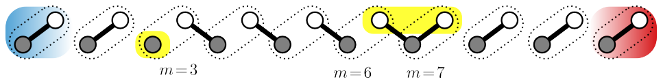
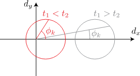

# SSH Topological Insulator

A compact, tested NumPy implementation of the one-dimensional Su-Schrieffer-Heeger (SSH) model. The repository demonstrates Bloch-band calculations, chiral symmetry, winding and Zak invariants, Wilson-loop evaluation, and finite-chain bulk-edge correspondence.



*Source: Fig. 1.1 in J. K. Asbóth, L. Oroszlány, and A. Pályi, **A Short Course on Topological Insulators: Band-Structure Topology and Edge States in One and Two Dimensions**, Lecture Notes in Physics 919, Springer (2016), [arXiv:1509.02295](https://arxiv.org/abs/1509.02295).*

## Highlights

- 2x2 Bloch Hamiltonian and open finite-chain Hamiltonian
- numerical band structure from Hermitian eigendecomposition
- gauge-invariant Zak phase from a discrete Wilson loop
- winding-number calculation for the chiral SSH model
- explicit bulk-edge verification through near-zero boundary states
- physics-based tests against analytic dispersion and symmetry constraints
- lightweight CI across Python 3.10-3.12

## Model

For intracell hopping `v` and intercell hopping `w`, the Bloch Hamiltonian in the `(A, B)` basis is

$$
H(k)=
\begin{bmatrix}
0 & v+w e^{-ik}\\
v+w e^{ik} & 0
\end{bmatrix}.
$$

Equivalently,

$$
H(k)=d_x(k)\sigma_x+d_y(k)\sigma_y,
\qquad
d_x=v+w\cos k,
\qquad
d_y=w\sin k.
$$

The band energies are

$$
E_\pm(k)=\pm\sqrt{v^2+w^2+2vw\cos k}.
$$

For real positive hoppings, the gap closes at `v = w` and `k = pi`. The chiral operator is `sigma_z`, with

$$
\{\sigma_z,H(k)\}=0.
$$

The winding number distinguishes the two gapped phases:

$$
\nu=0\quad(v>w),
\qquad
\nu=1\quad(v<w).
$$

With a consistent unit-cell convention, the Zak phase satisfies

$$
\gamma=\pi\nu\pmod{2\pi}.
$$



*Source: Fig. 1.5 in J. K. Asbóth, L. Oroszlány, and A. Pályi, **A Short Course on Topological Insulators: Band-Structure Topology and Edge States in One and Two Dimensions**, Lecture Notes in Physics 919, Springer (2016), [arXiv:1509.02295](https://arxiv.org/abs/1509.02295).*

## Installation

Clone the repository and install it in editable mode:

```bash
git clone https://github.com/fdtdengineer/ssh-topological-insulator.git
cd ssh-topological-insulator
python -m pip install -e .
```

For development and tests:

```bash
python -m pip install -e ".[dev]"
```

## Quick start

```python
import numpy as np

from ssh_model import (
    bloch_hamiltonian,
    open_chain_hamiltonian,
    winding_number,
    zak_phases,
)

v, w = 0.8, 1.0

Hk = bloch_hamiltonian(k=0.5, v=v, w=w)
print(np.linalg.eigvalsh(Hk))

print("winding number:", winding_number(v=v, w=w))
print("Zak phases / pi:", zak_phases(v=v, w=w) / np.pi)

H_open = open_chain_hamiltonian(n_cells=24, v=v, w=w)
print(np.linalg.eigvalsh(H_open))
```

A runnable version is available in [`examples/basic_ssh.py`](examples/basic_ssh.py). The original derivation notebook is retained at [`notebooks/ssh_tutorial.ipynb`](notebooks/ssh_tutorial.ipynb).

## Numerical topology

Eigenvectors returned by numerical eigensolvers have arbitrary phases at each momentum. The Zak phase is therefore evaluated with a gauge-invariant discrete Wilson loop rather than by directly differentiating the eigenvector phase:

$$
U_n=
\frac{\langle u(k_n)|u(k_{n+1})\rangle}
{|\langle u(k_n)|u(k_{n+1})\rangle|},
\qquad
W=\prod_n U_n,
\qquad
\gamma=\arg W.
$$

At the transition point, where the bulk gap closes, the isolated-band topological invariant is undefined.

## Bulk-edge correspondence

For an open chain in the topological regime `|w| > |v|`, one boundary mode appears at each edge in the large-system limit. In a finite chain the two states hybridize weakly, producing an exponentially small energy splitting around zero.

The test suite verifies this behavior numerically and also checks that a trivial chain does not contain corresponding near-zero modes.

## Project structure

```text
.
├── src/ssh_model/        # canonical numerical implementation
├── tests/                # analytic and physics-based regression tests
├── examples/             # minimal runnable examples
├── notebooks/            # tutorial / derivation notebook
├── figures/              # cited figures used by this README
└── .github/workflows/    # CI
```

The Python package under `src/ssh_model` is the canonical implementation. The notebook is retained as an explanatory derivation and visualization resource rather than as the source of library code.

## Tests

Run

```bash
pytest -q
```

The tests check:

- Hermiticity of the Bloch Hamiltonian
- agreement with the analytic SSH dispersion
- chiral anticommutation and symmetry breaking by a staggered onsite mass
- winding numbers in trivial and topological phases
- Wilson-loop Zak-phase quantization
- finite-chain bulk-edge correspondence

Linting is available with

```bash
ruff check src tests examples
```

## Reference

J. K. Asbóth, L. Oroszlány, and A. Pályi, *A Short Course on Topological Insulators: Band-Structure Topology and Edge States in One and Two Dimensions*, Lecture Notes in Physics **919**, Springer (2016). DOI: 10.1007/978-3-319-25607-8; arXiv:1509.02295.

## License

Released under the MIT License. See [`LICENSE`](LICENSE).
